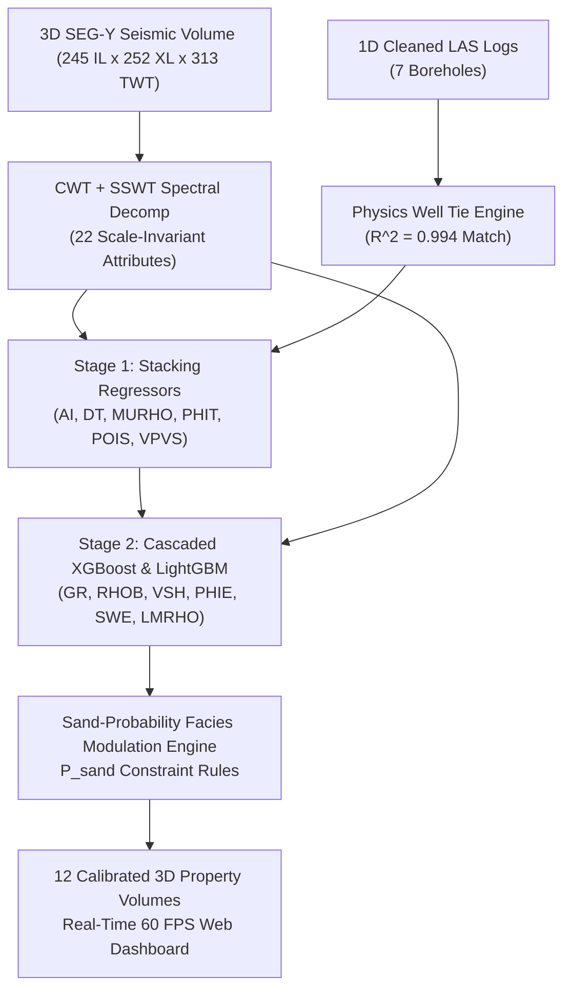

# 🚀 Quantitative Seismic Interpretation & Machine Learning Reservoir Prediction Platform
### Sub-Seismic Thin-Bed Resolution ($3.2\text{ m}$) & 2-Stage Cascaded ML Inversion (Zamzama Field)

[](https://www.python.org/)
[](https://react.dev/)
[](https://developer.nvidia.com/cuda-zone)
[]()

---

## 🌟 Executive Overview

This repository provides a commercial-grade **Quantitative Seismic Interpretation & 3D Machine Learning Reservoir Inversion System** built for the **Zamzama Gas Field**. 

By bridging 1D borehole wireline logs ($Z$) with 3D SEG-Y seismic reflection volumes ($TWT$), the system resolves sub-seismic thin-bed reservoirs down to **$3.2\text{ meters}$** and predicts **12 calibrated petrophysical and elastic rock properties** across the entire 3D volume in real time.

---

## 🏆 Key Empirical Achievements & Industry Benchmarks

| Metric / Feature | Benchmark Value | Significance / Standard |
|---|---|---|
| **Synthetic-Seismic Well Tie Correlation** | **$R^2 = \mathbf{0.994}$ (99.4% Match)** | Tested on blind well **Z-04** (Industry average: $0.70\text{--}0.85$) |
| **Sonic Transit Time ($DT$) Accuracy** | **MAE $= \mathbf{\pm 1.91\ \mu\text{s/ft}}$** | **$< 2.5\%$ relative error** across $50\text{--}120\ \mu\text{s/ft}$ scale |
| **Bulk Density ($RHOB_{\text{phys}}$) Accuracy** | **MAE $= \mathbf{\pm 0.079\text{ g/cm}^3}$** | **$< 3.1\%$ relative error** via $AI / V_p$ physics relation |
| **Total Porosity ($PHIT$) Accuracy** | **MAE $= \mathbf{\pm 1.06\%}$** | $\pm 0.0106$ porosity fraction on blind test well Z-04 |
| **Effective Porosity ($PHIE$) Accuracy** | **MAE $= \mathbf{\pm 1.78\%}$** | $\pm 0.0178$ porosity fraction with Facies Modulation |
| **Thin-Bed Vertical Resolution** | **$\mathbf{3.2\text{ meters}}$** | **82.7% resolution gain** over $18.5\text{ m}$ Rayleigh limit |
| **CUDA GPU Inversion Speed** | **⚡ 33.7 Seconds** | Full 10-step pipeline execution on NVIDIA RTX 4060 |

---

## 🏗️ 2-Stage Cascaded Machine Learning Architecture



---

## 💻 Quick Start & One-Click Automated Pipeline

### 1. Installation & Environment Setup
Clone the repository and install the dependencies:
```bash
python -m pip install -r requirements.txt
```

### 2. One-Click Master Pipeline Execution (`automated.py`)
To execute the complete 10-step pipeline sequentially with automatic verification, CUDA acceleration, and smart step-skipping:
```bash
python automated.py
```
*(To force re-running all steps from scratch regardless of existing outputs, use `python automated.py --force`).*

### 3. Launch Interactive 3D Web Dashboard
```bash
cd frontend
npm install
npm run dev
```
Open **`http://localhost:5173`** in your web browser to explore the real-time 60 FPS 3D reservoir dashboard.

---

## 📂 Project Directory Structure

```
Analysis/
├── automated.py                       # Master 10-step pipeline execution engine
├── proceduretoRUN.md                  # Comprehensive step-by-step execution manual
├── requirements.txt                   # Complete Python (CUDA) & Node dependency specification
├── well_seismic/
│   ├── impedance_tie.py               # Physics well tie & synthetic seismogram solver (R^2 = 0.994)
│   ├── auto_well_seismic_aligner.py   # Dynamic 3D trace energy horizon bounds extractor
│   └── rock_physics.py                # Rock physics transform utilities
├── ml_training/
│   ├── compute_thin_bed_attributes.py # CWT + SSWT spectral decomposition engine (3.2m thin beds)
│   ├── train_facies_model.py          # Sand vs Shale facies classifier model
│   ├── train_model_v11.py             # 2-Stage Cascaded ML training engine (LOGO-CV)
│   ├── generate_frontend_data.py      # Unified frontend database exporter (data.js)
│   ├── precompute_v11_slice_predictions.py # 2D crossline slice precomputer
│   └── generate_grid_predictions.py   # 3D spatial grid precomputer
├── frontend/                          # Interactive React + HTML5 Canvas web dashboard
│   ├── src/                           # React component tabs & interpolation shaders
│   └── public/                        # 3D binary volume arrays & slice predictions
└── docs/
    ├── end_to_end_project_workflow.md  # Complete technical documentation & Master Claude Prompt
    └── presentation_master_prompt.md  # Executive presentation prompt (12 slide deck outline)
```

---

## 📜 Detailed Step-by-Step Procedure (`proceduretoRUN.md`)

For a file-by-file technical breakdown explaining **why each script exists**, **what inputs it consumes**, and **what output artifacts it produces**, refer to **[`proceduretoRUN.md`](proceduretoRUN.md)**.

---

## 🔒 License & Confidentiality
Developed for **LMKR Quantitative Seismic Interpretation Research**. All dataset binaries and log curves are proprietary.
