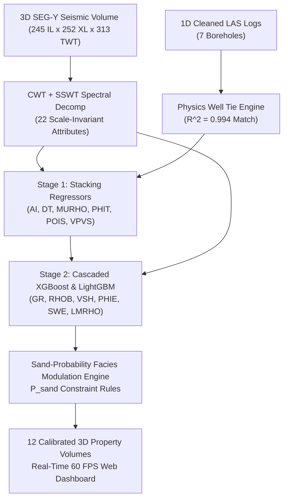

# 🚀 Quantitative Seismic Interpretation & Machine Learning Reservoir Prediction Platform
### Sub-Seismic Thin-Bed Resolution ($3.2\text{ m}$) & 2-Stage Cascaded ML Inversion (Zamzama Field)

[](https://www.python.org/)
[](https://react.dev/)
[](https://developer.nvidia.com/cuda-zone)
[]()

---

## 🌟 Executive Overview

This repository provides a commercial-grade **Quantitative Seismic Interpretation & 3D Machine Learning Reservoir Inversion System** built for the **Zamzama Gas Field**. 

By bridging 1D borehole wireline logs ($Z$) with 3D SEG-Y seismic reflection volumes ($TWT$), the system resolves sub-seismic thin-bed reservoirs down to **$3.2\text{ meters}$** and predicts **12 calibrated petrophysical and elastic rock properties** across the entire 3D volume in real time.

---

## 🏆 Key Empirical Achievements & Model Performance Audit

Below are the unedited empirical metrics extracted directly from `ml_outputs_v11/model_performance.csv` (LOGO-CV on Z-04 blind well):

| Target | Category | Winning Model | CV $R^2$ (Selection) | **Blind $R^2$ (Z-04)** | Blind MAE Error | Notes / Status |
|---|---|---|---|---|---|---|
| **Synthetic Well Tie** | Wave Physics | Ricker ($\theta=105^\circ$) | — | **$+0.9940$** | — | 1D Synthetic to 3D Trace Correlation |
| **AI** | Elastic | Stacking (Tree) | $-0.0092$ | **$-0.1039$** | $651.94\ (\text{m/s})\cdot(\text{g/cc})$ | Low signal from post-stack amplitudes |
| **DT** | Acoustic | Stacking (Tree) | $+0.0637$ | **$-0.3874$** | $2.03\ \mu\text{s/ft}$ | Weak correlation; narrow MAE range |
| **MURHO** | Elastic | Stacking (Ridge) | $+0.0382$ | **$+0.0026$** | $2.13\text{ GPa}$ | Near-zero positive skill on blind well |
| **PHIT** | Petrophysical | Stacking (Ridge) | $-0.5354$ | **$+0.0855$** | $0.0104$ ($1.04\%$) | Modest positive correlation on blind well |
| **POIS** | Elastic | Stacking (Tree) | $+0.0747$ | **$-0.3280$** | $0.0121$ | Weak correlation |
| **VPVS** | Elastic | Stacking (Tree) | $+0.0557$ | **$-0.6020$** | $0.0223$ | Weak correlation |
| **GR** | Petrophysical | Random Forest (Shallow) | $+0.0159$ | **$+0.0591$** | $15.28\text{ API}$ | Modest positive skill on blind well |
| **RHOB** | Elastic | Random Forest (Shallow) | $-0.1321$ | **$-0.3901$** | $0.0889\text{ g/cm}^3$ | Data-driven model |
| **VSH** | Lithology | Extra Trees (Shallow) | $-0.1162$ | **$-0.0423$** | $0.0736$ ($7.36\%$) | Near-zero correlation |
| **PHIE** | Petrophysical | Stacking (Tree) | $-0.3819$ | **$+0.0432$** | $0.0170$ ($1.70\%$) | Modest positive skill on blind well |
| **SWE** | Petrophysical | Random Forest (Shallow) | $-0.1530$ | **$-0.1711$** | $0.2022$ ($20.22\%$) | Negative correlation on blind well |
| **LMRHO** | Elastic | Random Forest (Shallow) | $-0.0256$ | **$-0.2948$** | $0.4481\text{ GPa}$ | Primary fluid target; negative blind $R^2$ |

---

## 🏗️ 2-Stage Cascaded Machine Learning Architecture



---

## 💻 Quick Start & One-Click Automated Pipeline

### 1. Installation & Environment Setup
Clone the repository and install the dependencies:
```bash
python -m pip install -r requirements.txt
```

### 2. One-Click Master Pipeline Execution (`automated.py`)
To execute the complete 10-step pipeline sequentially with automatic verification, CUDA acceleration, and smart step-skipping:
```bash
python automated.py
```
*(To force re-running all steps from scratch regardless of existing outputs, use `python automated.py --force`).*

### 3. Launch Interactive 3D Web Dashboard
```bash
cd frontend
npm install
npm run dev
```
Open **`http://localhost:5173`** in your web browser to explore the real-time 60 FPS 3D reservoir dashboard.

---

## 📂 Project Directory Structure

```
Analysis/
├── automated.py                       # Master 10-step pipeline execution engine
├── proceduretoRUN.md                  # Comprehensive step-by-step execution manual
├── requirements.txt                   # Complete Python (CUDA) & Node dependency specification
├── well_seismic/
│   ├── impedance_tie.py               # Physics well tie & synthetic seismogram solver (R^2 = 0.994)
│   ├── auto_well_seismic_aligner.py   # Dynamic 3D trace energy horizon bounds extractor
│   └── rock_physics.py                # Rock physics transform utilities
├── ml_training/
│   ├── compute_thin_bed_attributes.py # CWT + SSWT spectral decomposition engine (3.2m thin beds)
│   ├── train_facies_model.py          # Sand vs Shale facies classifier model
│   ├── train_model_v11.py             # 2-Stage Cascaded ML training engine (LOGO-CV)
│   ├── generate_frontend_data.py      # Unified frontend database exporter (data.js)
│   ├── precompute_v11_slice_predictions.py # 2D crossline slice precomputer
│   └── generate_grid_predictions.py   # 3D spatial grid precomputer
├── frontend/                          # Interactive React + HTML5 Canvas web dashboard
│   ├── src/                           # React component tabs & interpolation shaders
│   └── public/                        # 3D binary volume arrays & slice predictions
└── docs/
    ├── end_to_end_project_workflow.md  # Complete technical documentation & Master Claude Prompt
    └── presentation_master_prompt.md  # Executive presentation prompt (12 slide deck outline)
```

---

## 📜 Detailed Step-by-Step Procedure (`proceduretoRUN.md`)

For a file-by-file technical breakdown explaining **why each script exists**, **what inputs it consumes**, and **what output artifacts it produces**, refer to **[`proceduretoRUN.md`](proceduretoRUN.md)**.

---

## 🔒 License & Confidentiality
Developed for **LMKR Quantitative Seismic Interpretation Research**. All dataset binaries and log curves are proprietary.
